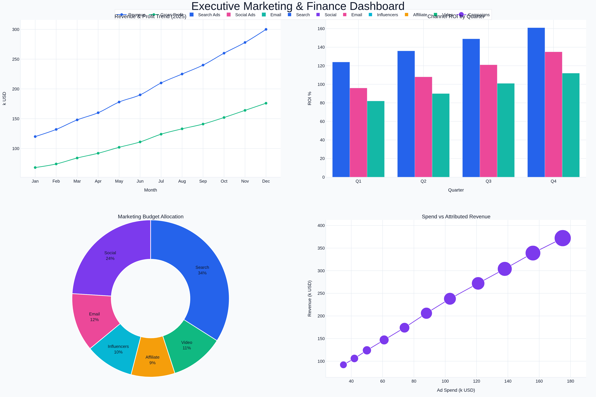
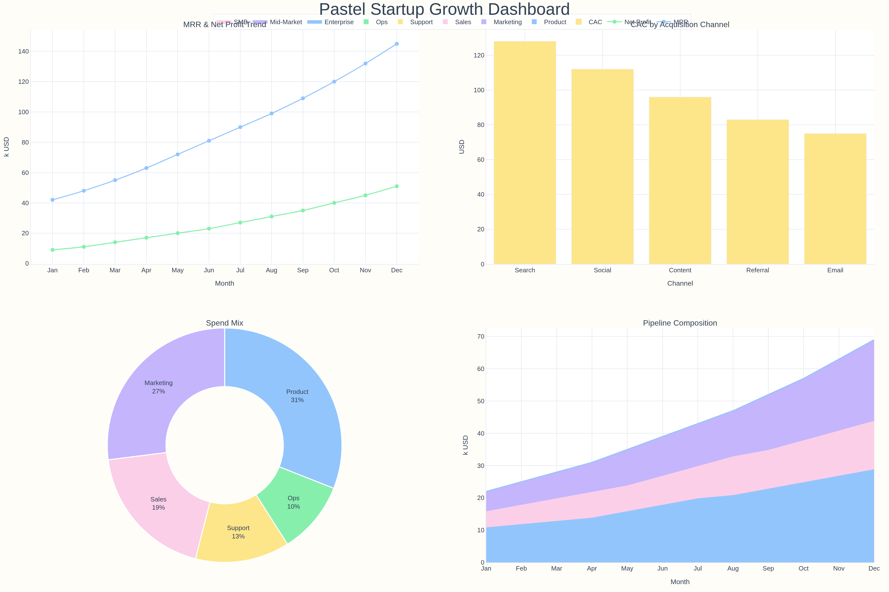
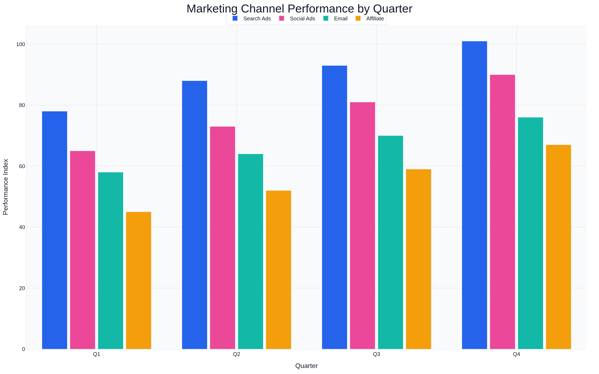
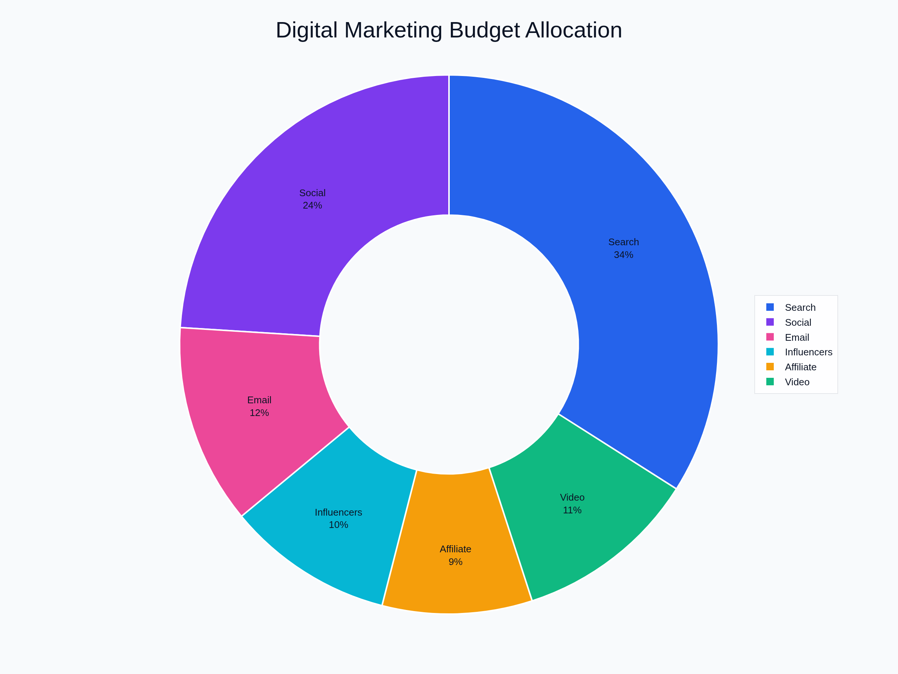
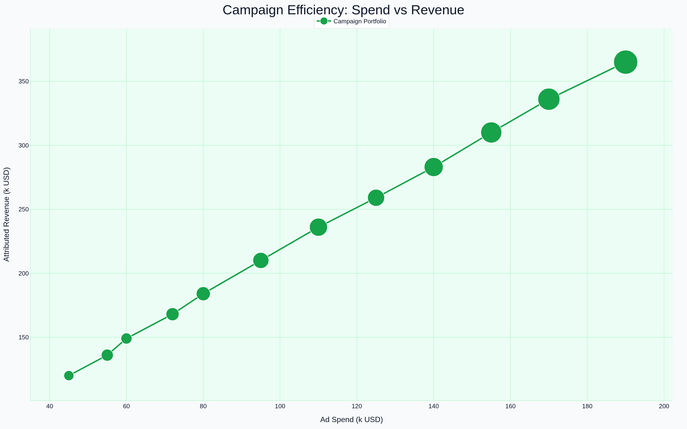
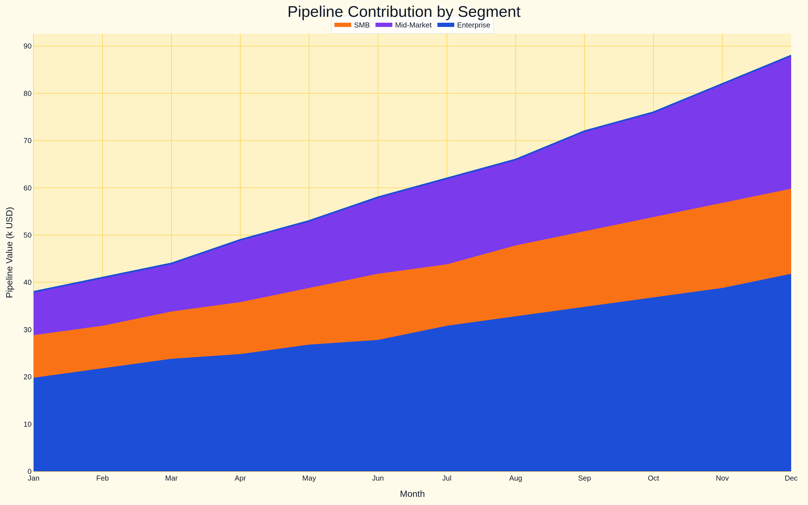

# vvk-charts-mcp

<p>
  <a href="https://github.com/valderan/vvk-charts-mcp/blob/main/LICENSE"></a>
  
  
  
</p>

Язык документации:

- Русский: `README_ru.md`
- English: [`README.md`](README.md)

Современный MCP сервер на Python для построения графиков и диаграмм (`line`, `bar`, `pie`, `scatter`, `area`, `combined dashboard`) с настраиваемыми темами и экспортом в PNG/SVG/base64.

<p align="center">
  
  <br />
  <em>Пример результата: комбинированный дашборд в стиле dark corporate, созданный через MCP tool.</em>
</p>

## Содержание

- [Возможности](#возможности)
- [Быстрый старт](#быстрый-старт)
- [MCP tools](#mcp-tools)
- [Пример payload для комбинированного дашборда](#пример-payload-для-комбинированного-дашборда)
- [Пример payload для терминального графика](#пример-payload-для-терминального-графика)
- [Демо-галерея](#демо-галерея)
- [AI пресеты (skill и agent)](#ai-пресеты-skill-и-agent)
- [Подключение в OpenCode (подробно)](#подключение-в-opencode-подробно)
- [Подключение в Codex (подробно)](#подключение-в-codex-подробно)
- [Локальная разработка](#локальная-разработка)

## Возможности

- MCP tools для одиночных графиков и смешанных дашбордов.
- Терминальные tools с ANSI-отрисовкой и авто-fallback в монохром.
- Современный стиль на базе Plotly и полная настройка темы.
- Поддержка нескольких серий и больших наборов данных.
- Форматы экспорта: `png`, `svg`, `base64`.
- Интерактивный CLI-клиент с готовыми шаблонами.

## Быстрый старт

Установка из GitHub через `uvx`:

```bash
uvx install git+https://github.com/valderan/vvk-charts-mcp.git
```

Запуск MCP сервера:

```bash
uvx run vvk-charts-mcp
```

Запуск интерактивного клиента:

```bash
uvx run vvk-charts-cli
```

CLI спрашивает, что рисовать, куда сохранять, в каком формате экспортировать и какой размер изображения использовать.

Подсказка: выберите `terminal` в `vvk-charts-cli`, чтобы увидеть дашборд прямо в консоли.

## MCP tools

| Tool | Назначение |
| --- | --- |
| `create_line_chart` | Тренды во времени |
| `create_bar_chart` | Сравнение категорий |
| `create_pie_chart` | Структура долей |
| `create_scatter_chart` | Корреляция и пузырьковые графики |
| `create_area_chart` | Накопительная/stack структура |
| `create_combined_dashboard` | Несколько типов графиков на одном изображении |
| `create_terminal_chart` | График для консоли (ANSI/монохром) |
| `create_terminal_dashboard` | Многопанельный текстовый дашборд для терминала |

Общие параметры для всех tools:

- `theme`, `title`, `width`, `height`
- `format` (`png`, `svg`, `base64`)
- `output_path`, `filename`

## Пример payload для комбинированного дашборда

```json
{
  "title": "Marketing Dashboard",
  "rows": 1,
  "cols": 2,
  "format": "png",
  "output_path": "./demo",
  "filename": "combined_dashboard",
  "panels": [
    {
      "type": "line",
      "row": 1,
      "col": 1,
      "title": "Revenue Trend",
      "x_label": "Month",
      "y_label": "k USD",
      "data": [
        {
          "name": "Revenue",
          "x": ["Jan", "Feb", "Mar", "Apr"],
          "y": [120, 132, 148, 160]
        }
      ],
      "options": {
        "line_shape": "spline"
      }
    },
    {
      "type": "pie",
      "row": 1,
      "col": 2,
      "title": "Budget Split",
      "data": [
        {
          "labels": ["Search", "Social", "Email"],
          "values": [45, 35, 20]
        }
      ],
      "options": {
        "hole": 0.45
      }
    }
  ]
}
```

## Пример payload для терминального графика

```json
{
  "tool": "create_terminal_chart",
  "arguments": {
    "type": "line",
    "title": "Revenue Trend (CLI)",
    "x_label": "Month",
    "y_label": "k USD",
    "theme": "dark_corporate_cli",
    "use_color": true,
    "force_mono": false,
    "data": [
      {
        "name": "Revenue",
        "x": ["Jan", "Feb", "Mar", "Apr", "May"],
        "y": [120, 132, 148, 160, 178]
      }
    ]
  }
}
```

## Демо-галерея

<p>
  
  
  
</p>

<p>
  
  
  
  
  
</p>

## AI пресеты (skill и agent)

В репозитории есть готовые пресеты в `ai/`:

- `ai/vvk-charts-skill.md` - skill-инструкция для формирования payload.
- `ai/vvk-charts-agent.md` - профиль агента под задачи визуализации.

Используйте любой вариант, который удобнее в вашем процессе.

## Подключение в OpenCode (подробно)

### 1) Добавить MCP сервер

Создайте или отредактируйте `opencode.json`:

```json
{
  "$schema": "https://opencode.ai/config.json",
  "mcp": {
    "vvkcharts": {
      "type": "local",
      "enabled": true,
      "command": [
        "uvx",
        "--from",
        "git+https://github.com/valderan/vvk-charts-mcp.git",
        "vvk-charts-mcp"
      ]
    }
  }
}
```

### 2) Установить как OpenCode skill

```bash
mkdir -p .opencode/skills/vvk-charts-mcp
cp ai/vvk-charts-skill.md .opencode/skills/vvk-charts-mcp/SKILL.md
```

### 3) Установить как OpenCode agent

```bash
mkdir -p .opencode/agents
cp ai/vvk-charts-agent.md .opencode/agents/vvk-charts.md
```

### 4) Проверка

- Запустите `opencode` в репозитории.
- Убедитесь, что видны tools `vvkcharts_*`.
- Тестовый запрос: `Build a monthly revenue line chart and save as png in ./output using vvkcharts`.

Ссылки на документацию:

- https://opencode.ai/docs/mcp-servers/
- https://opencode.ai/docs/skills/
- https://opencode.ai/docs/agents/

## Подключение в Codex (подробно)

Codex-совместимые клиенты могут различаться, но обычно работает следующая схема.

### 1) Зарегистрировать MCP сервер

```bash
uvx --from git+https://github.com/valderan/vvk-charts-mcp.git vvk-charts-mcp
```

Типичный JSON-конфиг у многих клиентов:

```json
{
  "mcpServers": {
    "vvkcharts": {
      "command": "uvx",
      "args": [
        "--from",
        "git+https://github.com/valderan/vvk-charts-mcp.git",
        "vvk-charts-mcp"
      ]
    }
  }
}
```

### 2) Переиспользовать skill и agent пресеты

- `ai/vvk-charts-skill.md` используйте как шаблон инструкций.
- `ai/vvk-charts-agent.md` используйте как системный промпт отдельного профиля.

### 3) Проверка

Пример запроса:

`Use vvkcharts tools to generate a bar chart and save it to ./output/sales-q1.png`.

## Локальная разработка

```bash
uv sync
uv run ruff check .
uv run mypy src
```

## Репозиторий

- https://github.com/valderan/vvk-charts-mcp

---

English documentation: [`README.md`](README.md)
